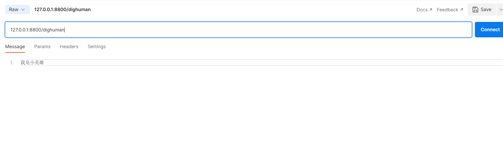

## 消息格式

通讯地址：`ws://127.0.0.1:8800/th`

### 发送文本

```
# 发送给api的message数据是str类型
{
	message:"输入的内容或问题"    
}
```

接口测试场景：Postman



### 返回视频

```json
# 返回数据的格式，Json
{
    'video': 'data:video/mp4;base64,xxx' 
}
```

| 参数  | 描述                                                       | 类型 | 是否必须 |
| ----- | ---------------------------------------------------------- | ---- | -------- |
| video | base64编码的视频流，前段接收时需要采用base64对视频进行解码 | str  | 是       |
|       |                                                            |      |          |

